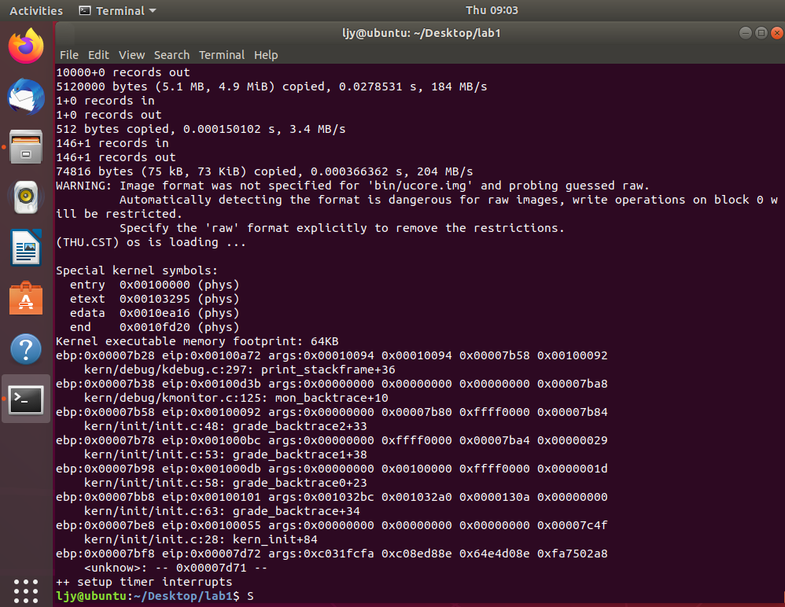

#  练习五

> 我们需要在lab1中完成对kdebug.c中函数print_stackframe的实现，可以通过函数print_stackframe来跟踪函数调用堆栈中记录的返回地址。、

首先，要明白函数调用中栈的详细情况。

> 补充:内联函数
>
> 在编译阶段，将内联函数的代码拷贝到当前地址，不需要函数地址的转移以及压栈出栈等操作。

根据注释，得出函数print_stackframe（）代码如下，

由 ebp 开始向上找两位所保存的值是第一个参数，以此类推。然后找到下一个函数栈的 eip 和 ebp,下一个函数的 eip 就是压入栈的返回地址，也就是当前 ebp 向上找一位所保存的值，下一个函数的 ebp 就是当前 ebp 保存的地址所指向的地方。

```c

uint32_t *ebp = 0; //定义为指针，方便访问
uint32_t esp = 0;
//查看文件发现read_ebp()和read_eip()都是inline内联函数
//这里read_ebp必须定义为inline函数，否则获取的是执行read_ebp函数时的ebp寄存器的值
 ebp = (uint32_t *)read_ebp();
//read_esp指令要
 esp = read_eip();

 while (ebp)
 {
     cprintf("ebp:0x%08x eip:0x%08x args:", (uint32_t)ebp, esp);
     cprintf("0x%08x 0x%08x 0x%08x 0x%08x\n", ebp[2], ebp[3], ebp[4], ebp[5]);

     print_debuginfo(esp - 1);

     esp = ebp[1];
     ebp = (uint32_t *)*ebp;
 }
  /* LAB1 YOUR CODE : STEP 1 */
  /* (1) call read_ebp() to get the value of ebp. the type is (uint32_t);
   * (2) call read_eip() to get the value of eip. the type is (uint32_t);
   * (3) from 0 .. STACKFRAME_DEPTH
   *    (3.1) printf value of ebp, eip
   *    (3.2) (uint32_t)calling arguments [0..4] = the contents in address (uint32_t)ebp +2 [0..4]
   *    (3.3) cprintf("\n");
   *    (3.4) call print_debuginfo(eip-1) to print the C calling function name and line number, etc.
   *    (3.5) popup a calling stackframe
   *           NOTICE: the calling funciton's return addr eip  = ss:[ebp+4]
   *                   the calling funciton's ebp = ss:[ebp]
   */
}                     
```

`make qemu`得到结果如下图



所打印信息与实验指导书中信息一致。

最后一行是`ebp:0x00007bf8 eip:0x00007d6e args:0xc031fcfa 0xc08ed88e 0x64e4d08e 0xfa7502a8`，共有`ebp`，`eip`和`args`三类参数，下面分别给出解释。

`ebp:0x0007bf8` 此时`ebp`的值是`kern_init`函数的栈顶地址，从bootblock.asm文件中知道整个栈的栈顶地址为`0x00007c00`，`ebp`指向的栈位置存放调用者的`ebp`寄存器的值，`ebp+4`指向的栈位置存放返回地址的值，这意味着`kern_init`函数的调用者（也就是bootmain函数）没有传递任何输入参数给它！因为单是存放旧的ebp、返回地址已经占用8字节了。

`eip:0x00007d6e eip`的值是`kern_init`函数的返回地址，也就是bootmain函数调用kern_init对应的指令的下一条指令的地址。这与bootblock.asm是相符合的。

`args:0xc031fcfa 0xc08ed88e 0x64e4d08e 0xfa7502a8` 一般来说，args存放的4个dword是对应4个输入参数的值。但这里比较特殊，由于bootmain函数调用kern_init并没传递任何输入参数，并且栈顶的位置恰好在boot loader第一条指令存放的地址的上面，而args恰好是kern_int的ebp寄存器指向的栈顶往上第2~5个单元，因此args存放的就是boot loader指令的前16个字节！可以对比bootblock.asm文件来验证